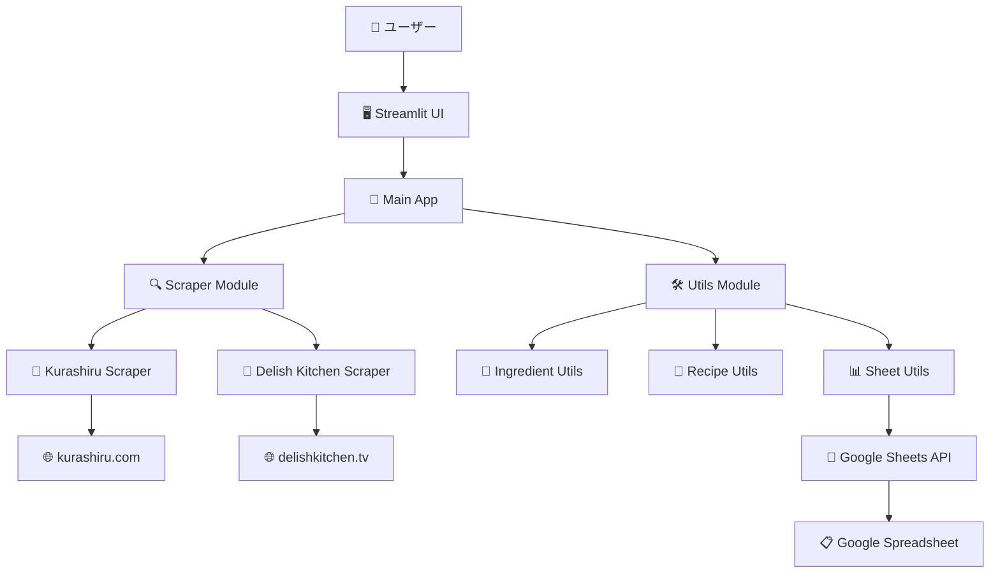

# システムアーキテクチャ

## 🏗️ アプリケーション構成図

## 🔧 技術スタック

| 層 | 技術 | 用途 |
|---|---|---|
| **フロントエンド** | Streamlit | ユーザーインターフェース |
| **バックエンド** | Python 3.8+ | アプリケーションロジック |
| **スクレイピング** | BeautifulSoup4, Requests | Webデータ抽出 |
| **API連携** | Google Sheets API, gspread | スプレッドシート操作 |
| **テスト** | pytest | ユニットテスト |
| **品質管理** | black, flake8, mypy | コード品質・型チェック |

## 📊 データフロー

1. **入力**: ユーザーがレシピURLと人数を入力
2. **抽出**: 各サイトからレシピ情報をスクレイピング
3. **解析**: 材料名と分量を構造化データに変換
4. **計算**: 指定人数に基づいて分量を調整・合算
5. **出力**: 買い物リストとしてUI表示 & スプレッドシートに保存

## 🛡️ エラーハンドリング

- **ネットワークエラー**: タイムアウト設定とリトライ機能
- **パースエラー**: 堅牢なHTML解析とフォールバック処理
- **データ変換エラー**: 型安全な処理と例外ハンドリング
- **API エラー**: Google Sheets API の適切なエラー処理
